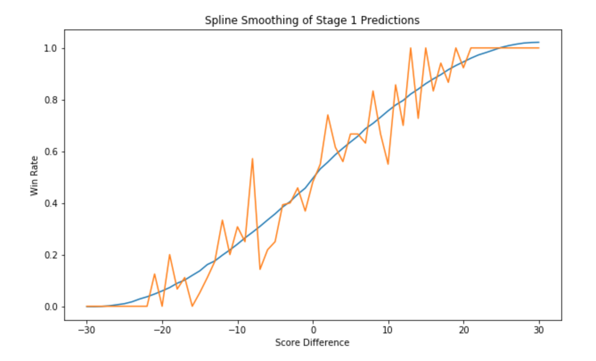

# Google-Cloud-NCAA-ML-Competition
**37th place solution** for  Google Cloud &amp; NCAA® ML Competition in Kaggle.

[Google Cloud & NCAA® ML Competition 2019-Women's](https://www.kaggle.com/c/womens-machine-learning-competition-2019)


<!--Finally this 2-month journey has finished, this is actually my first Kaggle competition I attend end to end. So excited to got the rank 45th and my first medal in Kaggle! 

I just try to write down all the timeline and procedures I followed in this journey, and organize all things I’ve learned from this competition.-->

## Key points in this competition:
 -  **Framework**: The modeling framework in this competition is quite different from other competition. The target cannot directly modeled, competitors need to go from data structing, feature extraction to target definition and model building.
 - **Randomness**: The dataset to be predicted and evaluated is quite small. Although we are predicting 64*63 = 4032 matches, but there are only 63 matchs that would actually happen, which means any match would have big influence on the log-loss.

## Key Strategies
- **Double the training data.** The first thing for this competition is to build the modeling framework based the given dataset. At first the data is structured in the unit of each game match, and got the feature based on two different teams. But we can actually build two records for each match, by setting away team as `Team_1`, home team as `Team_2`, or setting home team as `Team_1`, away team as `Team_2`, respectively.

- **Use two Stage model instead of one to optimize the target metric.** The evaluation metric is log-loss, which can be actually dirctly optimize by modeling, but there would be a problem for that: For one stage modeling, we can only build a classifier to optimize the log-loss, by setting predicted variable=0/1, but in this case, we actually lose much information in the ultimate scores. (For example, win with 80:79 would be the same as win with 80:40). So here I used two stage models:

 1. Stage1: Using a regression model to predict the score difference between `Team_1` and `Team_2`.
 2. Stage2: Based on the predictions of score difference from stage1, get the probability of win rate in the past for those prediction levels, and use spline interpolation to smooth it.
 

- **Use MAE in Regression Model Customize the Gradient Function.** In my experiments, I found using MAE as the loss function for the regression model would have a better performance than using the default MSE as the loss function. But there is a problem for using MAE as loss function - It is not second differenciable, which XGboost model would need. So I customized a function to approximate the first and second derivatives of MAE through cauchy equation.

```
def cauchyobj(preds, dtrain):
    labels = dtrain.get_label()
    c = 3000 
    x =  preds-labels    
    grad = x / (x**2/c**2+1)
    hess = -c**2*(x**2-c**2)/(x**2+c**2)**2
    return grad, hess
```

- **Manually Setting Cases With Small Probability.** There are some cases with really small probability, but the model cannot tell to make a aggressive prediction based the past performance, so I manually change the prediction make the predictions more aggressive. For example, in the past ten years, only one case that team with seeds > 12 ever defeated teams with seeds < 5. So I believe it is a safe strategy to set the top seed with 100% percent win rate in those game matches.


## Model
The model used in this competition is a single setting XGboost model, with different sets of cross validations folds to increase the model robustness.


## Things I learned from this competition:

* Think the problem from a grand view, using different stategy to define target and built up modeling framework.
* Optimizing the target through different ways, from model define to loss function design.
* First try customized gradient function for tree boosting models.
* Get more familiar with problem solving pipeline.
* Experience on modeling small dataset with a lot randomness.

## Things could have done better.

* Robustness could be improved if I can combine different models.
* I have not tried other smoothing techniques except for spline, some space for improvement in this.
* A more detailed EDA could be done based on the cases with tiny probalibity, which could be used to better take advantage of manual setting.